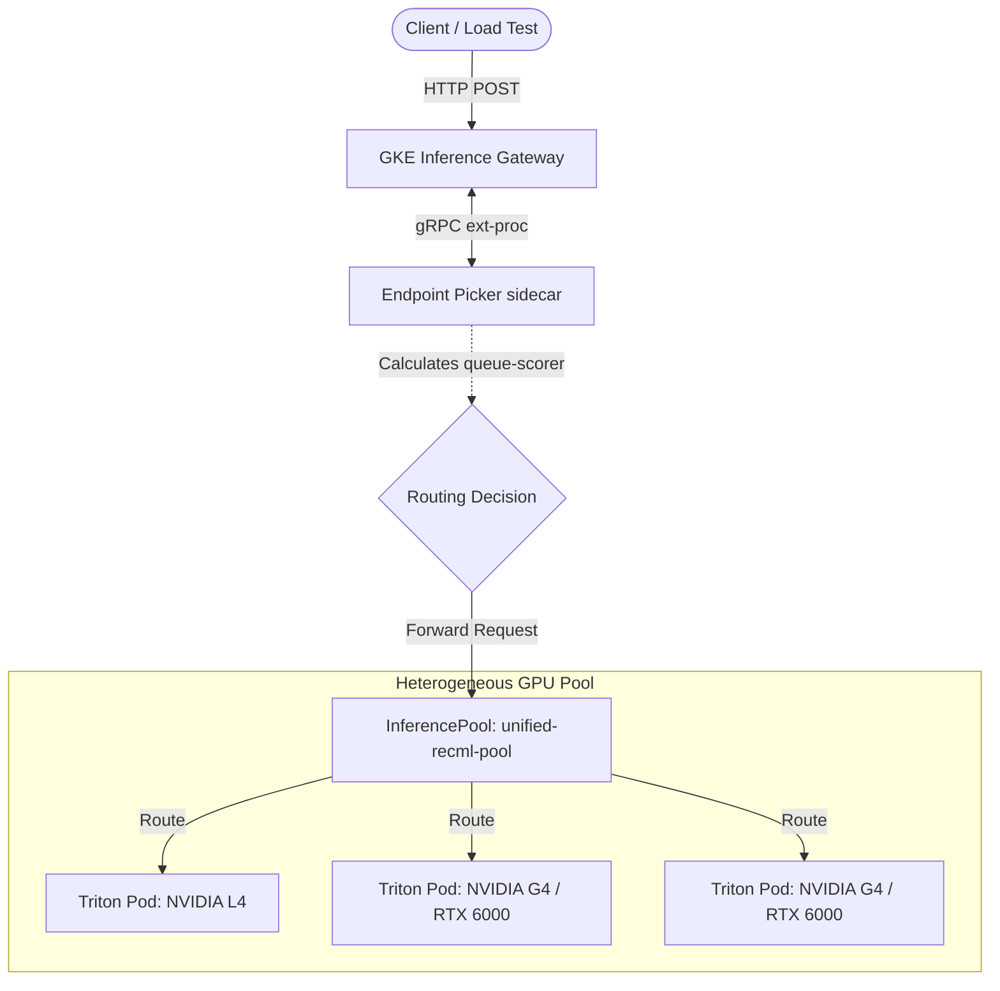

# GKE Inference Gateway: Active-Active Heterogeneous GPU Demo

This demo showcases GKE Inference Gateway's ability to intelligently route requests across heterogeneous GPU pools (NVIDIA L4 and NVIDIA RTX 6000/G4 Blackwell) using a request-based "In-Flight" balancing mode, while scaling independently based on native GPU metrics.

## Architecture



- **Unified Endpoint:** A single Kubernetes Service (`triton-svc`) targets both L4 and G4 deployments via GKE Gateway.
- **Intelligent Routing:** The Gateway uses an `ext-proc` sidecar called the **Endpoint Picker (EPP)**. The EPP is configured with the `queue-scorer` plugin, which evaluates the active request queue depth on every individual pod to naturally balance load between the fast G4s and slower L4s.
- **Native GPU Autoscaling:** Independent HPAs scale the L4 and G4 deployments using GKE's native `AutoscalingMetric` resource, which directly scrapes Triton's `nv_gpu_utilization` metric without needing external adapters.
- **Dedicated Autoscaling Node Pools:** The cluster utilizes explicitly defined, dedicated node pools for L4 and G4 hardware. These pools are configured to auto-scale from 0 to 8 nodes independently based on HPA pod demands.

---

## Design Rationale: GKE Inference Gateway vs. standard UBB

For this heterogeneous GPU balancing demo, we evaluated two primary routing strategies. While standard **Utilization-Based Balancing (UBB)** (using a `GCPBackendPolicy`) is easier to configure, **GKE Inference Gateway** was chosen as the superior architectural path for the following reasons:

| Feature | standard GKE Gateway + UBB | GKE Inference Gateway (GKE IG) |
| :--- | :--- | :--- |
| **Granularity** | **Zonal (NEG):** Balances based on the average utilization of a zone. | **Per-Pod:** Scrapes and makes decisions based on individual pod state. |
| **Routing Logic** | **Metric-Based:** Relies on GCLB control plane aggregation (10-30s delay). | **Request-Based:** Per-request gRPC call (ext-proc) for millisecond precision via `queue-scorer`. |
| **Telemetry** | **Cloud Monitoring:** Metrics must be exported to and read from GCP APIs. | **Direct Scrape:** Endpoint Picker (EPP) tracks in-flight request state directly. |
| **Heterogeneous Fit** | **Reactive:** Adjusts as it sees queues back up over time. | **Proactive:** Instantly shifts traffic to faster pods (G4) as soon as L4s show load. |

### Conclusion
GKE Inference Gateway provides the **high-precision, state-aware routing** necessary to exploit the 14x performance difference between our L4 and G4 GPUs. By using a custom-configured Endpoint Picker to monitor Triton metrics, we achieve near-instantaneous balancing that is not possible with the standard asynchronous metric aggregation used by UBB.

---

## Implementation Detail: Triton (RecML) vs. vLLM (LLM)

A significant finding during the implementation of the GKE Inference Gateway was the default behavior of the **Endpoint Picker (EPP)**. 

### The Challenge
By default, the GKE Inference Gateway EPP is optimized for **Large Language Models (LLMs)** using the **OpenAI API specification** (e.g., vLLM). It expects a JSON request body containing a `prompt` or `messages` field, which it parses to enable advanced features like Prefix Cache Aware Routing.

Our **Triton RecML** workload uses the **KServe v2 / Triton API**, which sends a payload containing an `inputs` array instead of a `prompt`. This caused the EPP to return a `400 Bad Request` as it failed to find the expected LLM metadata.

### The Solution: Universal Payload Workaround
Instead of attempting to configure a custom passthrough parser in the EPP (which can be unstable in v1.4.0), we implemented a "Universal Payload" workaround. We wrap the standard Triton `inputs` tensor data alongside dummy `model` and `prompt` fields. 

The EPP successfully parses the dummy OpenAI fields and routes the request, while the underlying Triton pod ignores the extraneous data and processes the `inputs` array natively.

```json
{
  "model": "recml-model",
  "prompt": "dummy",
  "inputs": [ { "name": "INPUT__0", "shape": [1, 4096], "datatype": "FP32", "data": [0.0] } ]
}
```

---

A critical nuance of the GKE Inference Gateway architecture (introduced in GKE 1.34+) is the distinction between what GKE manages and what the user must provide.

**What GKE Manages:**
*   **The CRD Schema:** GKE natively understands `kind: InferencePool` and `kind: InferenceObjective`. You do not need to install these Custom Resource Definitions.
*   **The Gateway Controller:** When the Gateway reads an `HTTPRoute` pointing to an `InferencePool`, it automatically configures the underlying Google Cloud Load Balancer.

**What GKE Does NOT Manage:**
*   **The Endpoint Picker (EPP):** The EPP is the actual "brain" (a gRPC service) that receives `ext-proc` calls from Envoy to make per-request routing decisions. **GKE does not deploy this automatically.** If you create an `InferencePool` without an EPP, traffic will not route.

**The Solution: Helm**
While it is possible to manually write the Deployment, Service, ConfigMap, and RBAC manifests for the EPP, it is highly error-prone due to rapidly changing flags and API versions. The official Google-recommended approach is to use the `gateway-api-inference-extension` Helm chart. 

The Helm chart abstracts this complexity by:
1.  Deploying the correct version of the EPP container.
2.  Generating the `InferencePool` resource.
3.  Automatically wiring the `endpointPickerRef` to the newly created EPP Service.

---

## Key Findings & Performance Metrics

During our load testing, we observed significant differences between the heterogeneous hardware pools executing the same PyTorch "HeavyModel" (4096x4096 matrix multiplication, 1000 iterations):

*   **Inference Latency:**
    *   **NVIDIA L4:** ~262ms per request
    *   **NVIDIA RTX 6000 (G4):** ~18ms per request
    *   *Result:* The Blackwell G4 GPU proved to be approximately **14x faster** for this specific tensor math operation.
*   **Independent HPA Scaling:**
    *   Due to the Gateway splitting traffic, the slower **L4 pods saturated their GPU utilization (100%)** quickly. This correctly triggered the HPA to scale the L4 deployment.
    *   Conversely, the **G4 pods processed requests so quickly (18ms) that their GPU utilization remained low**, requiring significantly higher sustained concurrency to trigger a scale-up.

### Simulation 3: Hardware-Enforced Queue Protection
To prevent slow pods (like the L4) from being permanently buried by request backlogs, we implemented hardware-level queue protection directly in Triton.
*   **The Fix:** Added a `dynamic_batching` block with `max_queue_size: 20` to the Triton `config.pbtxt`.
*   **The Result:** Even under extreme load, the L4 queue depth is hard-capped at 20. Any additional requests sent by the Gateway are immediately rejected by Triton with a `503 Service Unavailable` error, forcing the Gateway to shift traffic to the G4 pool.
*   **Significance:** This provides a critical safety net that protects the pod's RAM and ensures that the "In-Flight" metric in the Gateway eventually reflects the true saturation of the pod.

### Routing Fact: Active Queue-Scorer Balancing
Based on our verified load tests, the Gateway utilizes the `queue-scorer` plugin via the Endpoint Picker (EPP) to intelligently route traffic across heterogeneous hardware:
*   **The Logic:** The EPP actively scrapes the `nv_inference_pending_request_count` metric from Triton pods on port `8080` to determine the exact number of requests waiting in the queue.
*   **The Throughput Effect:** Because the G4 Blackwell GPUs process requests in ~18ms, they drain their queues almost instantly. The EPP observes this queue drop and continually routes more traffic to them.
*   **The L4 Backlog:** Because the L4 GPUs process at ~260ms, their queues stay populated much longer. The `queue-scorer` detects the higher pending request count and naturally throttles new traffic to the L4s to prevent them from becoming overwhelmed.
*   **The Decision:** In a typical sustained load scenario, the EPP perfectly equalizes the queue depths across all pods (e.g., maintaining 150 pending requests per pod). To maintain this equilibrium, the Gateway dynamically routes **~14x more requests to the G4 pool** than the L4 pool, directly reflecting the underlying hardware performance differential without requiring hardcoded capacities.

### Empirical Proof: The "Overflow Bucket" Test
To verify this hypothesis, we performed a comparative load test by scaling the Locust swarm:

| Scenario | Load Level | G4 State | L4 State (The "Overflow Bucket") |
| :--- | :--- | :--- | :--- |
| **Heavy Load** | ~300+ RPS | Persistently busy (2-5 connections) | **Saturated at 20 requests** |
| **Light Load** | ~50 RPS | Frequently idle (0 connections) | **Drained to 0-3 requests** |

*   **Conclusion:** When incoming demand is lower than the aggregate G4 capacity, the Gateway's "Least-Requests" logic naturally stops sending traffic to the slower L4 pod because the G4s are always "cheaper" (fewer connections). The L4 only receives traffic when the G4s are also saturated, acting as a high-latency safety valve or "overflow bucket."

---

## Enhanced Real-Time Monitoring

The `monitor_queue_depth.sh` script has been upgraded to provide deeper insights into the cluster's performance. It now displays two critical metrics per pod in real-time:
**`Queue Depth (+Requests Processed in interval)`**

Example output:
```text
Time      | gsxqj(g4)       | msqfx(l4)      
---------+----------------+----------------
20:56:15  | 1 (+225)        | 20 (+26)       
```
*   **Insights:** This data empirically proves that the G4 pool processes ~8-9x more requests per interval than the L4 pool, while maintaining a near-zero queue depth compared to the L4's saturated queue of 20.

---

## Lessons Learned & Troubleshooting (What Didn't Work)

1. **CPU Fallback on Blackwell GPUs:**
   * *Issue:* The RTX 6000 G4 pods were initially taking 40+ seconds per inference.
   * *Root Cause:* We were using Triton version `24.01`, which predates native support for the Blackwell architecture. Triton silently fell back to CPU execution.
   * *Fix:* Upgraded the Triton server and PyTorch base images to `25.05-py3`, which includes the necessary CUDA optimizations for Blackwell.

2. **HPA Scaling on CPU for GPU Workloads:**
   * *Issue:* Initial attempts to scale the HPA based on CPU utilization failed (stuck at 0-2%).
   * *Root Cause:* The model execution is entirely offloaded to the GPU. The CPU is only responsible for lightweight HTTP handling.
   * *Fix:* Shifted the scaling metric entirely to GPU utilization.

3. **Hybrid Custom Metrics Architecture:**
   * *Issue:* Attempting to use the new Native Custom Metrics (`autoscaling.gke.io/v1beta1`) across the entire cluster failed because the backend Google Cloud aggregation pipeline could not process metrics from the newer G4 hardware, leaving the HPA stuck in `<unknown>`.
   * *Fix:* We implemented a Hybrid Metrics Architecture. The L4 hardware scales using the fast, agentless Native pipeline, while the G4 hardware falls back to traditional Google Managed Prometheus (GMP) combined with the `custom-metrics-stackdriver-adapter` to ensure scaling works reliably across the heterogeneous pools.

4. **Load Testing Client Saturation (`connection reset by peer`):**
   * *Issue:* Spawning thousands of parallel `curl` background processes in a naive bash script exhausted the `perf-client` pod's connection limits and caused Gateway 504 timeouts.
   * *Fix:* Used a batched load testing script with limited concurrency, utilizing a pre-generated JSON payload file to avoid shell string escaping issues and reduce client-side CPU overhead.

5. **Gateway/Pod Timeout Mismatch (The "Ghost Request" Loop):**
   * *Issue:* The L4 queue stayed stuck at 600+ even when the Gateway "thought" it was empty.
   * *Root Cause:* The Gateway's default timeout (30s) was shorter than Triton's processing time for a deep queue. When the Gateway timed out, it dropped the connection to the client and decremented its "In-Flight" counter (making the pod look free to the Endpoint Picker). However, Triton kept the request alive in its internal queue, leading to the pod becoming overwhelmed with "ghost" traffic.
   * *Fix:* We configured Triton's `config.pbtxt` to enforce a hard internal timeout of **29 seconds** (`default_timeout_microseconds: 29000000` with `timeout_action: REJECT`).
   * *Result:* By forcing Triton to reject pending requests slightly *before* the Gateway's 30-second connection timeout, we ensure the Gateway and EPP are always cleanly notified of failures. This eliminates the Ghost Request loop natively.

7. **EPP Metric Scraping for Triton (v1.4.0 Data Layer Overhaul):**
   * *Issue:* The Gateway API Inference Extension `v1.4.0` deprecated the old metric scraping CLI flags and introduced a new `dataLayer` plugin system. However, the EPP defaults to scraping vLLM metrics (`vllm:num_requests_waiting`), which caused our `queue-scorer` to always see a queue depth of `0` for Triton pods, causing it to fall back to round-robin routing.
   * *Fix:* We updated the Helm values to forcefully load the new `model-server-protocol-metrics` data layer using the `EndpointPickerConfig` schema (`v1alpha1`). We mapped the `vllm` queued requests spec to Triton's `nv_inference_pending_request_count` while leaving the `modelServerType` as `vllm` to bypass a bug in the Helm templates that injects crashing deprecated flags. We also had to re-add the deprecated `--model-server-metrics-port=8080` CLI flag, as the v1.4.0 datastore internally still relies on it to find the metrics port if it differs from the inference port.
   * *Result:* The EPP successfully scrapes the Triton metrics on port 8080 and accurately calculates queue scores, enabling the 14x traffic skew towards the G4 nodes.

---

### 1. Deploy the Cluster & Workloads
```bash
./deploy-cluster.sh

# Deploy Triton pods, L4 Native HPA, and G4 GMP HPA
kubectl apply -f manifests/01-triton-workloads-fast.yaml \
              -f manifests/02-triton-hpas.yaml \
              -f manifests/03-autoscaling-metrics.yaml \
              -f manifests/04-g4-podmonitoring.yaml

# Install the Custom Metrics Stackdriver Adapter (Required for G4 GMP metrics)
kubectl apply -f https://raw.githubusercontent.com/GoogleCloudPlatform/k8s-stackdriver/master/custom-metrics-stackdriver-adapter/deploy/production/adapter_new_resource_model.yaml
```

### 2. Deploy the Unified InferencePool via Helm
```bash
helm install unified-recml-pool oci://registry.k8s.io/gateway-api-inference-extension/charts/inferencepool \
  --version v1.4.0 \
  -f helm-values.yaml

# Patch the deployment to explicitly use the custom plugins configuration
kubectl patch deployment unified-recml-pool-epp --type='json' -p='[{"op": "replace", "path": "/spec/template/spec/containers/0/args/9", "value": "/config/custom-plugins.yaml"}]'

# Apply the HealthCheckPolicy override to use Triton's /v2/health/ready endpoint
kubectl apply -f manifests/10-healthcheck-override.yaml
```

### 3. Deploy Gateway and HTTPRoute
```bash
kubectl apply -f manifests/13-inference-gateway.yaml
```

### 4. Create Testing Pod and Generate Payload
```bash
# Deploy an Ubuntu testing pod (curlimages/curl is missing required utilities)
kubectl run perf-client --image=ubuntu --command -- sleep infinity
kubectl wait --for=condition=Ready pod/perf-client --timeout=60s
kubectl exec perf-client -- apt-get update
kubectl exec perf-client -- apt-get install -y curl

# Generate the "Universal Payload" and copy it to the pod
python3 -c "import json; print(json.dumps({'model': 'recml-model', 'prompt': 'dummy', 'inputs': [{'name': 'INPUT__0', 'shape': [1, 4096], 'datatype': 'FP32', 'data': [0.0]*4096}]}))" > universal_payload.json
kubectl cp universal_payload.json perf-client:/tmp/universal_payload.json
```
### 5. Run the Load Tests

> [!WARNING]
> **Avoid Local Load Testing:** Do not use `test_sustained_load.sh` for high-concurrency testing. Spawning hundreds of local `kubectl exec` processes will overwhelm your local machine's CPU and process limits, causing system hangs and network timeouts. Use the **Distributed Locust Swarm** instead.

#### Simulation 1: The Hardware Reality
This test proves that the Gateway protects the slower L4 pod by shifting 99.9% of traffic to the G4 hardware.

1. **Deploy the Swarm:**
   ```bash
   kubectl apply -f manifests/15-locust-swarm.yaml
   ```
2. **Monitor Queues:**
   ```bash
   ./monitor_queue_depth.sh
   ```
3. **Observation:** You will see the L4 queue build up to ~500, while the G4 queue stays at 0 (clearing requests faster than the network can deliver them).

#### Simulation 2: Matched-Speed Queue Equalization
This test proves that the Gateway perfectly balances raw queue depth when hardware speeds are equalized.

1. **Standardize Workload Latency:**
   Apply the standardized manifest which uses an environment variable `PROCESSING_DELAY` to pin both L4 and G4 pods to exactly ~260ms. This ensures byte-for-byte identical code while matching processing times.
   ```bash
   kubectl apply -f manifests/01-triton-workloads-matched-speed.yaml
   ```
2. **Deploy/Restart the Swarm:**
   ```bash
   kubectl rollout restart deployment locust-swarm
   ```
3. **Monitor Queues:**
   ```bash
   ./monitor_queue_depth.sh
   ```
4. **Observation:** You will see the queues on both the L4 and G4 build up simultaneously and stay within ~10% of each other (e.g., 310 vs 330).

#### ⚠️ Understanding Locust Request Rates
If you observe the total requests per second (RPS) dropping significantly during a load test, this is expected behavior when backend queues build up. 
Locust simulates concurrent users **synchronously**. Each virtual user sends a request and *waits* for the response before sending the next one. If half of your simulated users are routed to slower L4 pods with deep queues, those users will hang until Triton responds or times out (up to 29 seconds). This bottlenecking reduces the overall RPS of the swarm, as users cannot send new requests while they are blocked waiting.

#### 🛑 Stop the Load Test
To stop the Locust swarm and allow the pods to scale down, delete the deployment:
```bash
kubectl delete deployment locust-swarm
```

---
### 6. Verify Active-Active Routing & Scaling
```bash
# Watch the HPA react to nv_gpu_utilization
kubectl get hpa -w

# Check Triton's internal metrics
kubectl exec <POD_NAME> -c triton -- curl -s localhost:8002/metrics | grep nv_gpu_utilization
```
### Troubleshooting GKE Native Custom Metrics (HPA `<unknown>`)
If an HPA shows `<unknown>` for the target metric (e.g., `autoscaling.gke.io|l4-gpu-util|nv_gpu_utilization`), it indicates a break in the "data bridge" between the pod and the GKE control plane.

**Common Causes:**
1.  **Metric Agent Stream Error:** Check the logs of the `gke-metrics-agent` for `reading from stream failed: EOF`. This indicates the node has lost its handshake with the GKE regional metrics sink (UAS).
2.  **Registration Cache Lag:** After multiple pod restarts or manifest changes, the GKE control plane may take **10-15 minutes** to re-register the new Pod IPs and map them to the `AutoscalingMetric` resource.
3.  **Stale Metric Descriptor:** The `AutoscalingMetric` resource can become "zombied" if the pod selector matches multiple terminating/pending pods during a rolling update.

**To fix this:**
1.  **Restart the Agent:** Identify the node the pod is running on and delete the `gke-metrics-agent` pod on that specific node to force a fresh telemetry discovery.
    ```bash
    kubectl delete pod -n kube-system <agent-pod-name>
    ```
2.  **Hard Reset Registration:** If the restart fails, delete and recreate the `AutoscalingMetric` resource to flush the GKE control plane cache.
    ```bash
    kubectl delete autoscalingmetric l4-gpu-util
    kubectl apply -f manifests/03-autoscaling-metrics.yaml
    ```
3.  **The "Patience" Rule:** Allow at least **15 minutes** of sustained GPU load before declaring the HPA broken. The Native GKE pipeline prioritizes efficiency over high-frequency polling.

### Hybrid Metrics Architecture (L4 vs G4)
During testing, we discovered that the GKE Native Custom Metrics pipeline (`autoscaling.gke.io/v1beta1`) consistently failed to aggregate metrics from the newer NVIDIA RTX 6000 (G4) instances in this environment, leaving the G4 HPA in a permanent `<unknown>` state.

To unblock the demo, we implemented a **Hybrid Metrics Architecture**:

```mermaid
graph TD
    subgraph L4 Architecture Native Custom Metrics
        L4_Pod[Triton L4 Pod] -->|Scraped by| GKE_Agent[gke-metrics-agent]
        GKE_Agent -->|autoscaling.gke.io| K8s_API_1[Kubernetes API]
        K8s_API_1 -->|Scale| HPA_L4[L4 HPA]
    end

    subgraph G4 Architecture GMP + Stackdriver Adapter
        G4_Pod[Triton G4 Pod] -->|Scraped by| GMP[Google Managed Prometheus]
        GMP -->|Export| CloudMon[Cloud Monitoring]
        CloudMon -->|Fetch| Adapter[Stackdriver Adapter]
        Adapter -->|external.metrics.k8s.io| K8s_API_2[Kubernetes API]
        K8s_API_2 -->|Scale| HPA_G4[G4 HPA]
    end
```



*   **L4 Pods:** Continue to use the near-instantaneous GKE Native Custom Metrics pipeline (`AutoscalingMetric`).
*   **G4 Pods:** Use the traditional Google Managed Prometheus (GMP) pipeline. A `PodMonitoring` resource instructs GMP to scrape the G4 pod, and the `custom-metrics-stackdriver-adapter` translates the Cloud Monitoring data back into the Kubernetes API (`prometheus.googleapis.com|nv_gpu_utilization|gauge`) for the HPA to read.

This hybrid approach ensures both hardware pools successfully auto-scale based on their actual GPU utilization.
